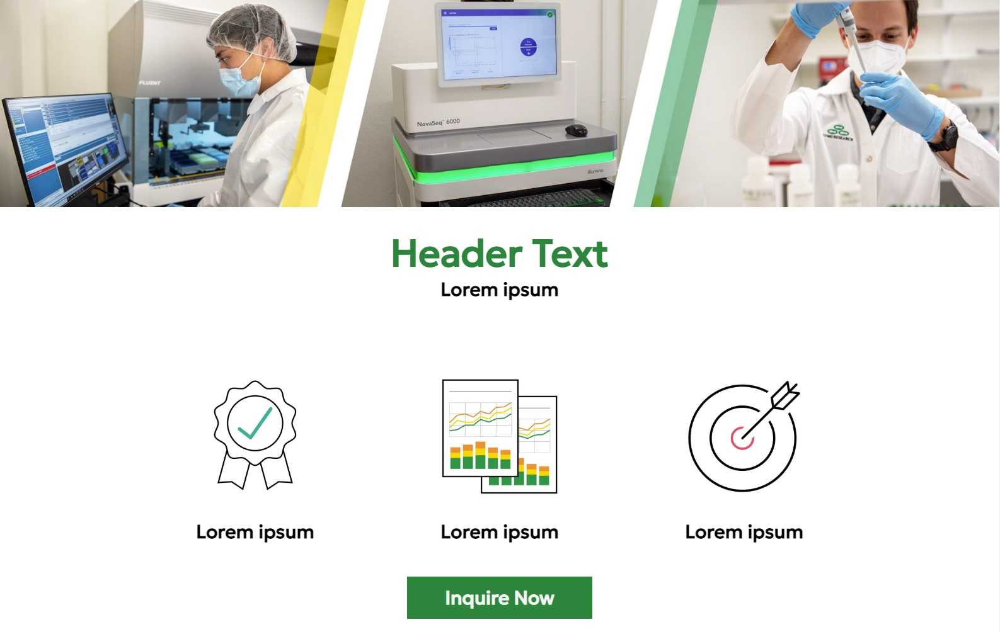

# [Zymo Research Landing Page](https://monysary.github.io/zymo-landing-page/)



The new Zymo Research Landing page! Users can view updated information regarding the company and be able to submit a form to provide feedback and comments. This landing page features a hero section with icons to highlight the benefits of working with Zymo and their products, and a button to quickly navigate to the form section. The main content of the page features information about the company history and their products and services offered to clients (in lorem ipsum format). The landing page comes featured with smooth animations and responsiveness for various screen sizes.

Visit the webpage and check out all it has to offer!

## Links:

+ [Website Link](https://monysary.github.io/zymo-landing-page/)


## Repository

Within the repo you'll find the following directories and files:

```
zymo-landing-page/
├── assets/
|   ├── css/
|   |   ├── reset.css
|   |   ├── style.css
|   ├── images/
|   |   ├── banner.jpg
|   |   ├── bullseye_icon.jpg
|   |   ├── checkmark_icon.jpg
|   |   ├── graphs_icon.jpg
|   |   ├── header-landing-page.jpg
|   └── js/
|       └── script.js
├── index.html
├── LICENSE
└── README.md

```


## License

- Created by Mony Sary for the Zymo Research 2023 Summer Internship Program
- Licensed under MIT


## Resources

- All images used in the webpage were provided by Zymo Research
